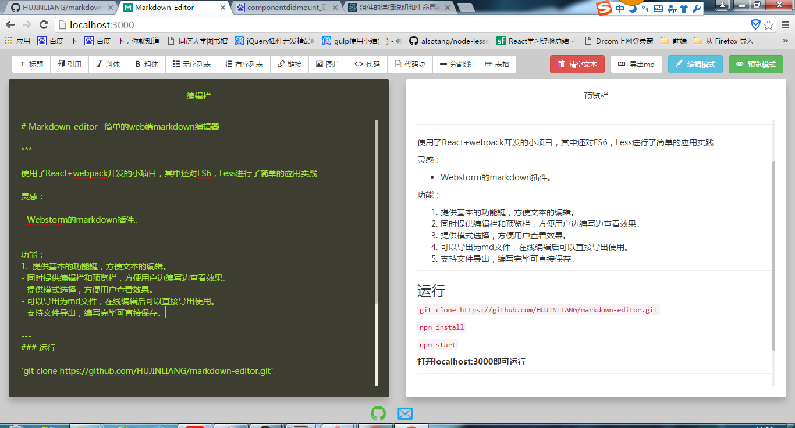

# Markdown-editor--简单的web端markdown编辑器

***

使用了React+webpack开发的小项目，其中还对ES6，Less进行了简单的应用实践

灵感：

- Webstorm的markdown插件。

功能：

1.  提供基本的功能键，方便文本的编辑。
2.  同时提供编辑栏和预览栏，方便用户边编写边查看效果。
3.  提供模式选择，方便用户查看效果。
4.  可以导出为md文件，在线编辑后可以直接导出使用。
5.  支持文件导出，编写完毕可直接保存。

---
### 运行

`git clone https://github.com/HUJINLIANG/markdown-editor.git`

`npm install`

`npm start`

**打开localhost:3000即可运行**

## ScreenShots

项目demo：[Markdown-editor](http://htmlpreview.github.io/?https://github.com/HUJINLIANG/markdown-editor/blob/master/index.html)

--- 
### 后期可能进行扩展的功能
- 用户登录：用户可进行登录（第三方登录，如qq,github等等）。
- 文件存储：用户登录后可以将文件存储至数据库中。